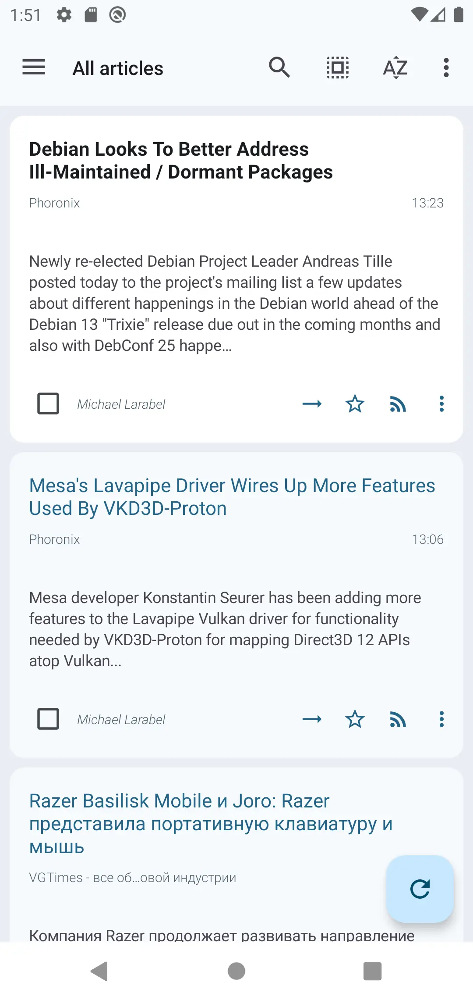
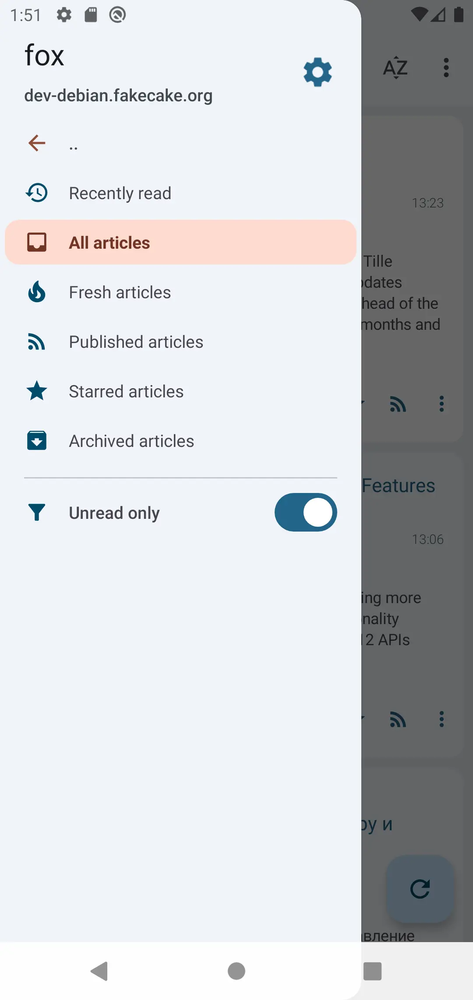
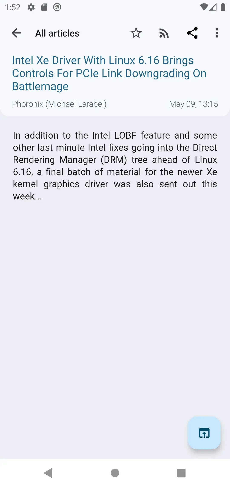
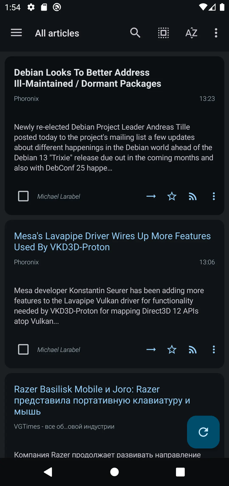
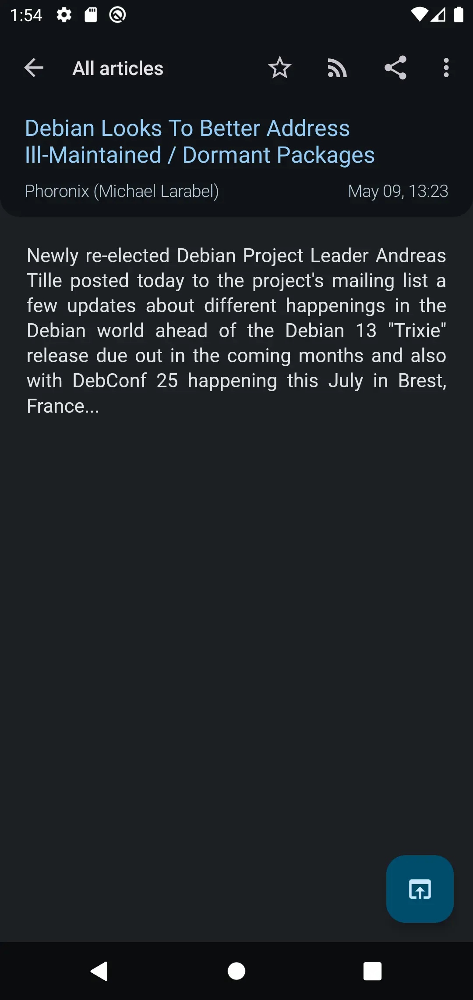

## **IMPORTANT**

* The original tt-rss-android project, hosted at <https://tt-rss.org/> and its various subdomains,
  went away on 2025-11-01.
* There are currently no plans to continue maintaining the app.
* The app's source code may be found at <https://github.com/tt-rss/tt-rss-android>.
* APKs that were available at <https://gitlab.tt-rss.org/tt-rss/tt-rss-android/-/releases> are gone.
* This page's content should only be treated as a historical reference.
* Refer to <https://github.com/tt-rss/tt-rss-android/discussions/8> for more information.

## Screenshots

[](../images/tt-rss-android/Screenshot_20250509_135136.webp)

[](../images/tt-rss-android/Screenshot_20250509_135154.webp)

[](../images/tt-rss-android/Screenshot_20250509_135217.webp)

[](../images/tt-rss-android/Screenshot_20250509_135426.webp)

[](../images/tt-rss-android/Screenshot_20250509_135438.webp)

## Download

Releases are built automatically for every commit pushed to master branch and [published on Gitlab](https://gitlab.tt-rss.org/tt-rss/tt-rss-android/-/releases).

{: .warning }
> This is the only official and supported way to get the APK. If you see the app on any marketplace or anywhere else, it had been uploaded there without my knowledge or consent.

Release APKs are signed. You can verify the signature using [apksigner](https://developer.android.com/tools/apksigner):

```sh
$ apksigner verify --print-certs org.fox.ttrss-signed.apk
Signer #1 certificate DN: CN=Andrew Dolgov, OU=N/A, O=tt-rss.org, L=Saint-Petersburg, ST=N/A, C=RU
Signer #1 certificate SHA-256 digest: c74664ba0fd8f8c97e2a548926609df1369236dd9d9d14c0e5c20b8c2b08cf06
Signer #1 certificate SHA-1 digest: ac97a3ced638cd750272dab50c08ca979910dc74
Signer #1 certificate MD5 digest: e4f38ce99c44714e3c21821a1c13717f
```

Signature digests must match above values.

## FAQ

### How do I automatically update the APK?

There's no built-in auto updater, I suggest using [Obtainium](https://obtainium.imranr.dev/) instead.

When adding new application in Obtainium, paste [app project page](https://gitlab.tt-rss.org/tt-rss/tt-rss-android) in first field, and select "Gitlab" in the "Override source" dropdown below.

### I want to help test the app! Are there development builds available?

Sometimes. Releases are not created for signed non-master branch builds, you can get the APKs from [build pipeline artifacts](https://gitlab.tt-rss.org/tt-rss/tt-rss-android/-/jobs) - look for `build-signed-branch-apk`. Non-master builds install as a separate application with a gray icon.

### Why are you not on Google Play?

As a small time FOSS developer, dealing with Google and their marketplace is a tremendous pain in the ass.
