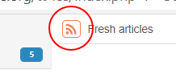
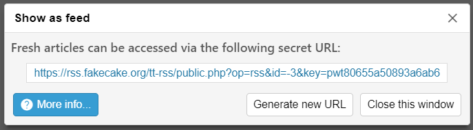

You can generate a feed (in Atom or JSON format) for almost anything displayed
in headlines buffer (e.g. actual feeds, Labels, Categories, etc.) by clicking
this icon:



{: .warning }
> Subscribing to your own feed of search results is going to produce
> duplicate articles on each and every feed update.

## Data protection

Feed URLs are protected using random unique keys which are specific to each
generated feed. Key can be regenerated at any time, invalidating previous URL.



You can clear all generated feeds in Preferences (`Feeds` &rarr; `Published-&
shared articles`).

## Anatomy of a generated feed URL

```text
http://example.com/tt-rss/public.php?op=rss&id=61&is_cat=1&view-mode=adaptive&key=...
```

- ``id`` (integer) - requested feed ID
- ``is_cat`` (boolean) - whether the feed is a category
- ``view-mode`` (string) - see below
- ``key`` (string) - automatically generated access key, specific to feed id

### Optional parameters

- ``login``, ``pass`` - see above
- ``format`` - since version:1.6.0 specifies output format, possible values: ``atom``, ``json``
- ``limit`` - amount of articles to output, default: 30
- ``offset`` - start output while skipping this amount of articles, default: 0
- ``order`` - override default headlines order
- ``ts`` - output articles newer than timestamp in [strtotime](http://www.php.net/manual/en/function.strtotime.php)
    accepted format (since version 1.12) i.e. stuff like <code>ts=1%20month%20ago</code>

### Special feed IDs

- ``-1`` - Starred articles
- ``-2`` - Published articles
- ``-3`` - Fresh articles
- ``-4`` - All articles
- ``0`` - Archived articles

Feed ID values less than `-10` are considered Labels.

### Special category IDs (is\_cat=1)

- ``0`` - Uncategorized
- ``-1`` - Special category (includes Starred, Published, etc.)
- ``-2`` - Labels category (includes your labels)

### View mode values

Note: It's probably not a very good idea to use Adaptive view mode for
generated feeds.

- <code>adaptive</code> - shows unread articles only when they are
    unread articles, shows everything otherwise
- <code>marked</code> (this means starred), <code>has\_note</code>,
    <code>published</code>, <code>unread</code>,
    <code>unread\_first</code> - should be self explanatory

Actual output may differ between modes for several special feeds for
usability reasons, e.g. recently read feed ignores <code>unread</code>
specifier because unread articles are never part of the feed).

### Order values

- ``default`` - depends on the feed: either import batch date or (for published and starred feeds) ``last_published`` and ``last_marked``
- ``title`` - sort by title
- ``date_reverse`` - reverse sort by batch date
- ``feed_dates`` - sort by feed-provided article dates

See also: [Publish Articles](Publish-Articles.md)
