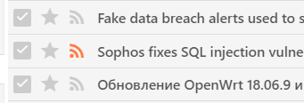

You can publish selected articles to a special RSS feed, accessible to anyone
who knows the special randomly-generated URL. This works independently of
[Generated-Feeds](Generated-Feeds.md) which allows you to share entire feeds,
categories, etc.

You can mark articles as published by clicking [standard feed
icon](http://feedicons.com/) near headline title:

Resulting URL is displayed in Preferences (`Feeds` &rarr; `Published & shared-articles`).

> [!NOTE]
> You can also publish articles automatically using filters (`Action` &rarr; `Publish-article`).
