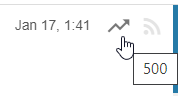

Scoring is supported in a way similar to some newsreaders. Score is calculated
on article import using special filters with a "Modify score" action.

Resulting score is a sum of all score modifiers from all matching filters. For
example, if the article matches two filters A (score-+100) and B (score--50),
the resulting score will be 50.

Article score affects the position of the article in the headline buffer (which
is sorted by score) and alters the way article is displayed:

| Score | Display / Action |
|-------|------------------|
| `<-500` | Score indicator points down, article is automatically marked as read |
| `<-100` | Score indicator points down |
| `<0`    | Score indicator points down, 1.5.0: article is excluded from Fresh feed and (as of 1.5.10 also excluded from email-digest) |
|   `0`   | Display normally |
| `>0`    | Score indicator points up |
| `>500`  | Score indicator points up |
| `>1000` | Same as above, article is also marked as starred |

### Adjusting manually

Calculated score for an individual article may be adjusted by clicking on score
indicator in the headlines list:

