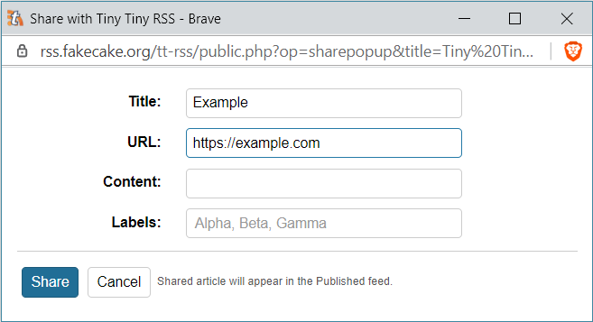

You can share arbitrary webpages to appear as articles in your ``Published``
feed. Combined with Readability this makes tt-rss function like a read it later
kind of website.

Sharing is available via bookmarklet in Preferences: (`Feeds`-&rarr;
`Bookmarklets`) (if you have ``bookmarklets`` plugin-enabled) or through Android
application.

Since they have no actual originating feed, shared articles are placed into
[Archived articles](Archived-Feed) feed and then set published.
