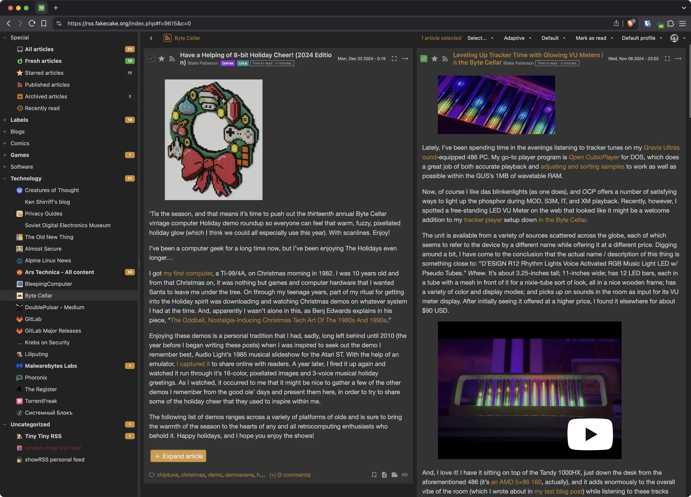
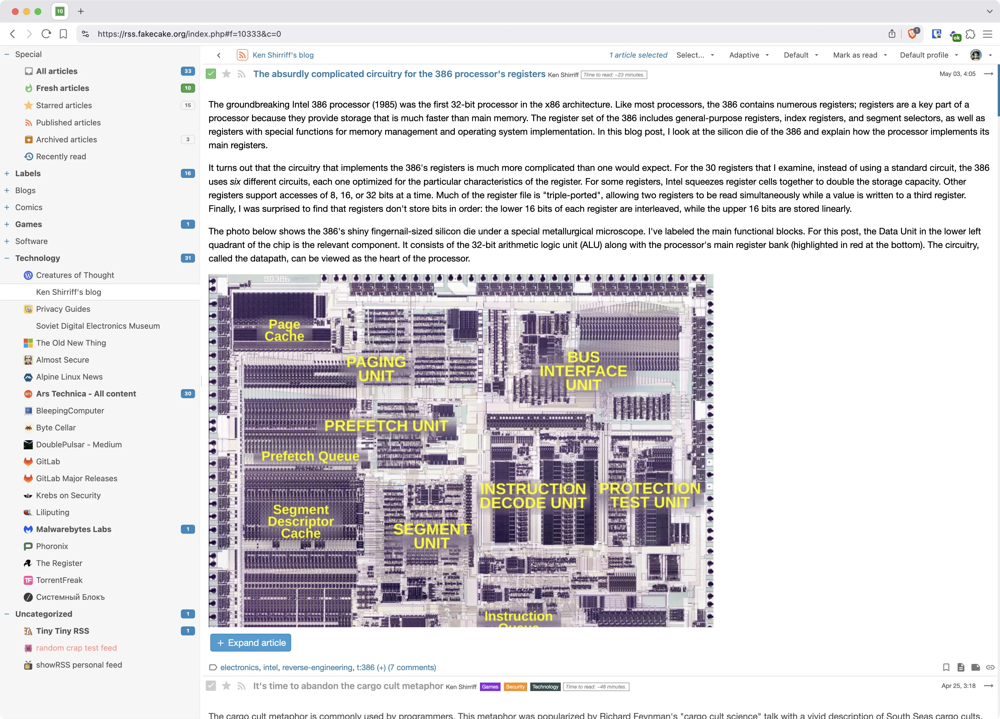
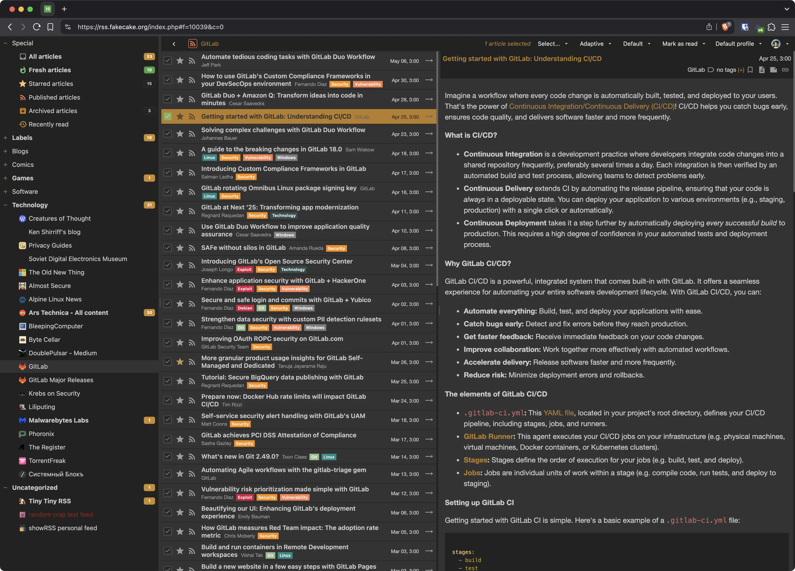

{: .no_toc }

Tiny Tiny RSS (tt-rss) is a free, flexible, open-source, web-based news feed (RSS/Atom/other) reader and aggregator.

## Screenshots

## Features

- Free software, licensed under [GNU GPLv3](http://www.gnu.org/copyleft/gpl.html)
- Self-hosted: control your own data and protect your privacy instead of relying on third party services
- Supports:
  - organizing feeds by folders (and subfolders)
  - [feed aggregation / syndication](docs/Generated-Feeds.md)
  - keyboard shortcuts
  - OPML import/export
  - multiple ways to share stuff: export RSS feeds, plugins for various social sites, sharing by URL, etc.
  - [sharing arbitrary content through tt-rss](docs/Share-Anything.md)
  - [Plugins](docs/Plugins.md) and [themes](docs/Themes.md)
  - embedding full article content via readability and site-specific plugins
  - deduplication, including [perceptual hashing](https://github.com/tt-rss/tt-rss-plugin-perceptual-image-hash) for images
  - podcasts
  - [flexible article filtering](docs/Content-Filters.md)
  - [JSON API](docs/API-Reference.md)
  - and much more…
- [Android Client](docs/Android-Client.md)

## Installation

You will need the following:
* A modern web browser.  This generally means a recent version of Chrome/Chromium or Firefox.
* A system running Docker.

See the [Installation Guide](docs/Installation-Guide.md) for detailed instructions.

{: .warning }
> If you choose to run tt-rss without using Docker support might be limited.
>
{: .note }
> Tiny Tiny RSS uses a continuous development model based on the `main` branch, which is considered stable.
> It's strongly recommended that you remain current-- meaning using either the most recent Docker image(s) or commit on `main`.

## Get in touch

* Go to [https://github.com/tt-rss/tt-rss/discussions](https://github.com/tt-rss/tt-rss/discussions) if you have questions or want to discuss something.
* Go to [https://github.com/tt-rss/tt-rss/issues](https://github.com/tt-rss/tt-rss/issues) if you want to report an issue, request an enhancement/feature, etc.

## Documentation

Browse the documentation:

- [Installation Guide](docs/Installation-Guide.md)
- [API Reference](docs/API-Reference.md)
- [Plugins](docs/Plugins.md) and [Making Plugins](docs/Making-Plugins.md)
- [Themes](docs/Themes.md)
- [Content Filters](docs/Content-Filters.md)
- [FAQ](docs/FAQ.md)
- [Global Configuration](docs/Global-Config.md)

## Development and Contributing

* Contributions (documentation improvements, translations, reporting issues, etc.) are welcome.
* Development and issue tracking primarily happens in [https://github.com/tt-rss/tt-rss](https://github.com/tt-rss/tt-rss).
* Help translate tt-rss into your own language using [Weblate](https://hosted.weblate.org/engage/tt-rss/).

---

<small>This documentation is licensed under [CC BY-SA 4.0](LICENSE). The tt-rss software is licensed under [GNU GPLv3](https://www.gnu.org/copyleft/gpl.html).</small>
